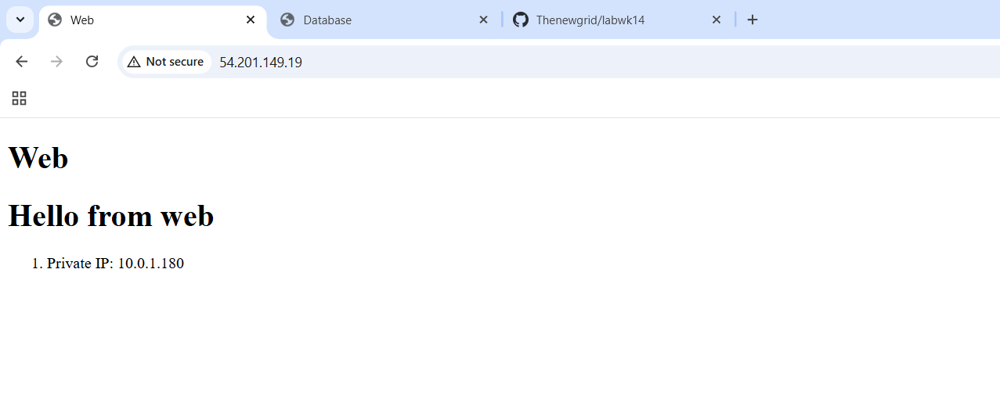
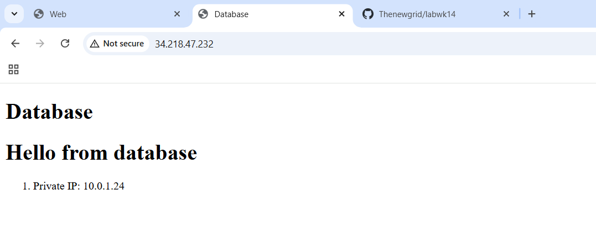

# Kevin Ding, Ahmed Ali, Hanan Kakooza, Gautam Dhoopar

## How to run (Assumes you already setup the AWS keypair)  

Clone the repo

CD into the ```terraform``` folder

Run ```terraform format``` to check syntax

Run ```terraform apply``` to create the instances 

CD into the ```ansible``` folder     
Run ```ansible-playbook --syntax-check playbook.yml``` to check syntax (It shouldn't return any errors)    
Run ```ansible-playbook playbook.yml``` to configure the hosts     

## Screenshots




